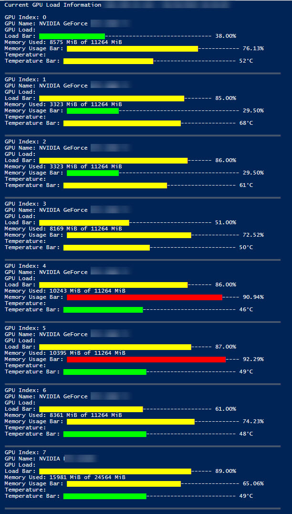

# GPU Stats Monitoring

## Overview
This PowerShell script (`GPUStatsMonitor.ps1`) is designed to monitor GPU statistics remotely using the Posh-SSH module. It retrieves detailed GPU information including the GPU index, name, load percentage, memory usage, and temperature from a remote server. The script displays these statistics in the console with visual bars that vary in color based on the usage level—making it highly readable and informative.

## Features
- **GPU Index and Name**: Identifies GPUs by their index and name.
- **Load Monitoring**: Monitors and displays GPU load as a percentage with a color-coded bar.
- **Memory Usage**: Shows memory usage in MiB, also represented with a color-coded bar.
- **Temperature**: Reports the GPU temperature in Celsius with visual representation.
- **Automatic Refresh**: Updates GPU stats every 5 seconds to provide real-time monitoring.

## Usage
To run the script, follow these steps:
1. Ensure that the Posh-SSH module is installed in your PowerShell environment.
2. Set the server IP address, username, and password in the script.
3. Run the script in PowerShell:
   ```powershell
   .\GPUStatsMonitor.ps1


## Requirements
- PowerShell 5.0 or higher
- Posh-SSH module

## Author
This script was authored by [aviado1](https://github.com/aviado1).

## Disclaimer
This script is provided "as is", without warranty of any kind, express or implied. While every effort has been made to provide a quality monitoring tool, the responsibility for the use and the results obtained from this script lies solely with the user.


### Explanation:
- **Overview**: A brief introduction to what the script does and its primary function.
- **Features**: A detailed list of what the script monitors and its functionalities.
- **Usage**: Step-by-step instructions on how to set up and run the script.
- **Requirements**: Lists the technical requirements to use the script.
- **Author**: Credits the script to you with a link to your GitHub profile.
- **Disclaimer**: Includes a short disclaimer noting that the script comes without warranties and that the user assumes all responsibility.

This format will look good on GitHub and should be very clear to anyone who reads it, providing all the essential information needed to understand and use the script effectively.
